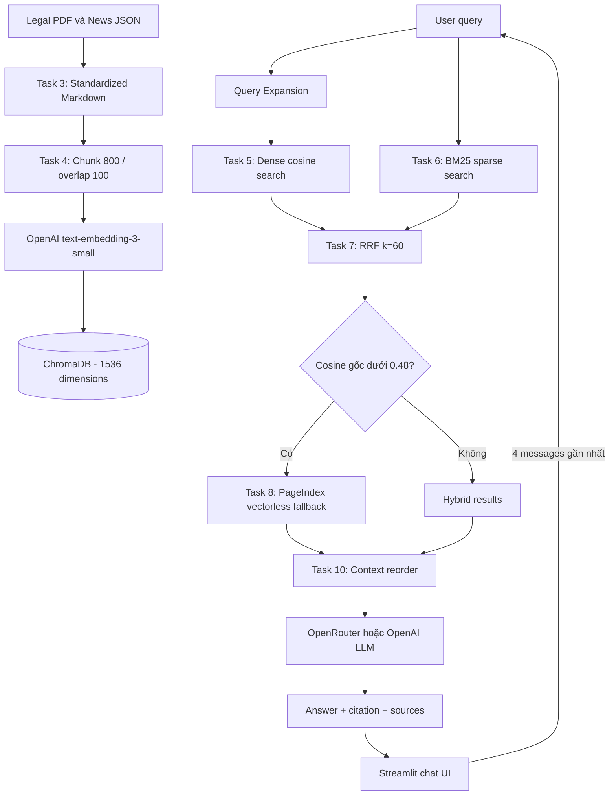

# Vietnamese Labour Law RAG Pipeline

Hệ thống RAG hỗ trợ tra cứu quyền và nghĩa vụ lao động tại Việt Nam: thử việc,
hợp đồng, tiền lương, làm thêm giờ, nghỉ phép, chấm dứt hợp đồng và bảo hiểm xã
hội. Câu trả lời được sinh từ corpus của nhóm, có citation và danh sách nguồn.

> Nội dung chỉ phục vụ học tập và tra cứu, không thay thế tư vấn pháp lý.

## Kết quả nghiệm thu

- **Tasks 1–10:** `35/35 passed`.
- **Toàn bộ suite:** `39 passed` gồm 4 test bonus/integration.
- **Dữ liệu:** 15 legal files, 6 news files, 11 standardized Markdown files.
- **RAGAS:** đủ 15 golden Q&A, 4 metrics và 2 cấu hình A/B.
- **Hybrid average:** `0.7576`; Dense-only average: `0.6743`.
- Streamlit đã kiểm thử end-to-end: citation, source viewer, Query Expansion và
  conversation memory hoạt động; không có lỗi console.

## Kiến trúc hệ thống



Điểm RRF chỉ dùng xếp hạng. Điều kiện fallback luôn dùng cosine similarity gốc,
không dùng RRF score khoảng `0.016`.

## Phân công công việc

| Thành viên | MSSV | Role | Nhiệm vụ chính | Trạng thái |
|---|---|---:|---|---|
| Ngô Hoàng Phú | 2A202601244 | 1 | Leader, kiến trúc, tích hợp pipeline và demo | Hoàn thành |
| Nguyễn Trung Long | 2A202601514 | 2 | Thu thập/chuẩn hóa data, chunking, Dense Search | Hoàn thành |
| Đinh Quốc Việt | 2A202601891 | 3 | BM25/PageIndex, generation, Streamlit UI và bonus | Hoàn thành |
| Nguyễn Xuân Kiên | 2A202601398 | 4 | Golden dataset, RAGAS A/B, QA và báo cáo | Hoàn thành |

Nhóm thực hiện chung toàn bộ pipeline. Phân công trên thể hiện trách nhiệm chính để
truy vết deliverable, không tách riêng phần 50 điểm cá nhân khỏi sản phẩm nhóm.

## Tasks 1–10

| Task | Nội dung | Implementation |
|---:|---|---|
| 1 | Thu thập văn bản pháp luật | `src/task1_collect_legal_docs.py` |
| 2 | Crawl bài viết chính thống | `src/task2_crawl_news.py` |
| 3 | Chuẩn hóa sang Markdown | `src/task3_convert_markdown.py` |
| 4 | Chunking, embedding và ChromaDB | `src/task4_chunking_indexing.py` |
| 5 | Semantic Search + Query Expansion | `src/task5_semantic_search.py` |
| 6 | BM25 và TF-IDF lexical search | `src/task6_lexical_search.py` |
| 7 | RRF reranking | `src/task7_reranking.py` |
| 8 | PageIndex vectorless fallback | `src/task8_pageindex_vectorless.py` |
| 9 | Retrieval pipeline hoàn chỉnh | `src/task9_retrieval_pipeline.py` |
| 10 | Reorder, generation và citation | `src/task10_generation.py` |

## Cài đặt

Yêu cầu Python 3.10 hoặc 3.11.

```powershell
python -m venv .venv
.\.venv\Scripts\Activate.ps1
python -m pip install -r requirements.txt
Copy-Item .env.example .env
```

Điền secrets vào `.env`; file này đã được `.gitignore` và không được commit:

```env
OPENAI_API_KEY=...
OPENROUTER_API_KEY=...       # tùy chọn cho generation
PAGEINDEX_API_KEY=...
PAGEINDEX_DOC_ID=...         # hoặc dùng pageindex_doc_ids.json
```

## Khởi tạo dữ liệu và index

Repository đã chứa corpus và ChromaDB để demo ngay. Khi thay đổi dữ liệu, chạy lại:

```powershell
python -m src.task3_convert_markdown
python -m src.task4_chunking_indexing
```

Upload tài liệu PageIndex lần đầu:

```powershell
python -m src.task8_pageindex_vectorless
```

## Chạy chatbot

```powershell
python -m streamlit run app.py
```

Mở `http://localhost:8501`. Kịch bản demo đề xuất:

1. Hỏi “Thời gian thử việc tối đa và lương thử việc tối thiểu là bao nhiêu?”.
2. Mở **Tài liệu tham khảo** để xem citation, source, score và highlight.
3. Hỏi nối tiếp “Còn công việc khác thì sao?” để demo memory.
4. Bật/tắt Query Expansion và thay đổi `top_k`.

## Kiểm thử

```powershell
# 50 điểm Tasks 1–10
python -m pytest tests/test_individual.py -v

# Bonus và tích hợp
python -m pytest tests/test_bonus_and_integration.py -v

# Toàn bộ
python -m pytest -q
```

Task 8 dùng mock đúng PageIndex response contract trong automated test để kết quả
không phụ thuộc credits/mạng. Trước khi demo fallback live, cần kiểm tra tài khoản
PageIndex còn credits.

## RAGAS A/B evaluation

```powershell
python -m group_project.evaluation.eval_pipeline --top-k 5
```

| Metric | Hybrid + RRF | Dense-only | Delta |
|---|---:|---:|---:|
| Faithfulness | 0.7622 | 0.5881 | +0.1741 |
| Answer Relevancy | 0.4166 | 0.3662 | +0.0505 |
| Context Recall | 0.8778 | 0.8111 | +0.0667 |
| Context Precision | 0.9740 | 0.9317 | +0.0423 |
| **Average** | **0.7576** | **0.6743** | **+0.0834** |

Deliverables:

- `group_project/evaluation/golden_dataset.json`
- `group_project/evaluation/eval_pipeline.py`
- `group_project/evaluation/results.md`
- `group_project/evaluation/evaluation_artifacts.json`

## Bonus 20 điểm

| Hạng mục | Điểm | Bằng chứng |
|---|---:|---|
| Lexical khác BM25 | 5 | TF-IDF word/bigram + cosine trong Task 6 |
| Semantic Search nâng cao | 5 | Query Expansion tích hợp Task 5 → Task 9 → UI |
| Deploy online | 4 | Dockerfile, Render Blueprint; URL public cần tài khoản nhóm |
| Conversation memory | 3 | 4 messages gần nhất, history không được dùng làm evidence |
| UI/UX | 3 | Sources, score, channel, highlight, suggestions, download chat |

## Deploy

Các file triển khai đã chuẩn bị:

- `Dockerfile`
- `render.yaml`
- `requirements-runtime.txt`
- `.streamlit/config.toml`

Trên Render chọn **New → Blueprint**, kết nối repository và khai báo secrets theo
`render.yaml`. Healthcheck: `/_stcore/health`.

## Báo cáo

- Báo cáo nhóm: `reports/GROUP_REPORT.md`
- Kịch bản CP6: `reports/DEMO_SCRIPT.md`
- Báo cáo cá nhân: `reports/individual/`
- Hướng dẫn chi tiết sản phẩm: `group_project/README.md`

## Trạng thái checkpoint

| Checkpoint | Nội dung | Trạng thái |
|---:|---|---|
| CP0 | Môi trường và API configuration | Hoàn thành |
| CP1 | Thu thập và chuẩn hóa dữ liệu | Hoàn thành |
| CP2 | Chunking, indexing, Dense/BM25 | Hoàn thành |
| CP3 | RRF và PageIndex integration | Hoàn thành; cần credits để demo API live |
| CP4 | Tasks 1–10 — 35/35 test | Hoàn thành |
| CP5 | Streamlit + RAGAS A/B | Hoàn thành |
| CP6 | Demo script và deployment config | Sẵn sàng; chờ URL public và push `main` |
