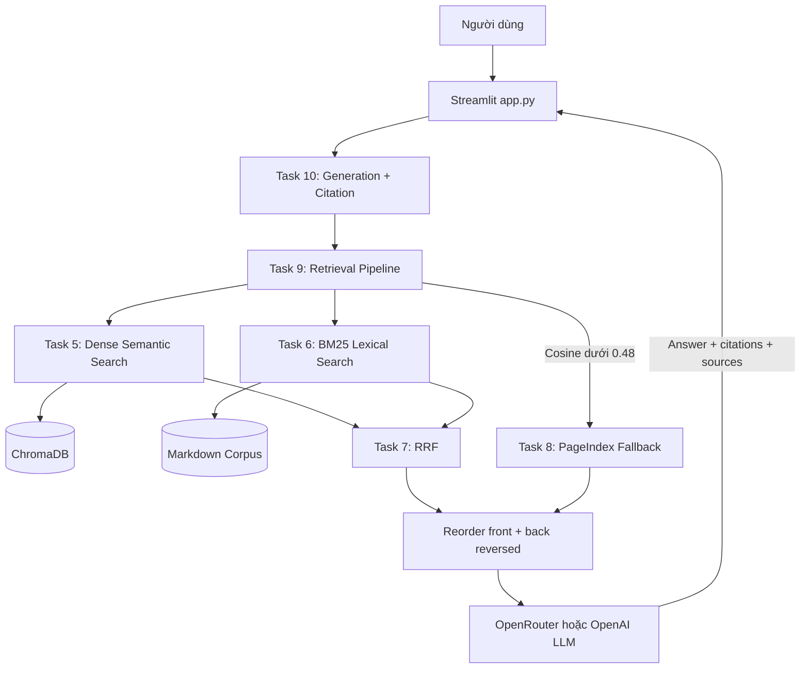

# Bài nhóm — Trợ lý Luật Lao động Việt Nam

Chatbot RAG hỗ trợ người trẻ tra cứu các vấn đề phổ biến như thử việc, hợp đồng,
tiền lương, làm thêm giờ, nghỉ phép và quyền lợi khi nghỉ việc. Câu trả lời chỉ
dựa trên corpus của nhóm và phải kèm trích dẫn nguồn.

## Tính năng CP5

- Giao diện chat Streamlit, lịch sử hội thoại và câu hỏi demo.
- Điều chỉnh `top_k` từ 3–10 ngay trên sidebar.
- Hybrid Retrieval: OpenAI embedding + ChromaDB kết hợp BM25.
- RRF hợp nhất thứ hạng; PageIndex fallback khi cosine `< 0.48`.
- Reorder context chống “lost in the middle” trước khi gọi LLM.
- Citation theo đúng nhãn `[Nguồn N: tên-tài-liệu]`.
- Hiển thị nguồn, score, loại tài liệu, mục liên quan và highlight từ khóa.
- Conversation memory tối đa 4 tin nhắn, có thể bật/tắt.
- Tải lịch sử chat dưới dạng Markdown và xóa session khi demo lại.
- Xử lý lỗi API thân thiện, không hiển thị hoặc ghi log API key.

## Kiến trúc



## Phân công CP5 — Role 1, 2, 3

| Role | Phần việc CP5 | Deliverable đã tích hợp |
|---|---|---|
| Role 1 — Leader/Architect | Chọn phiên bản code tốt nhất, ghép pipeline, kiểm tra kiến trúc và khả năng demo | `app.py`, sơ đồ kiến trúc, hướng dẫn chạy và checklist demo |
| Role 2 — Pipeline Integration | Nối `generate_with_citation()` vào luồng câu hỏi, truyền `top_k` và history, nhận `answer/sources/retrieval_source` | Luồng end-to-end Task 9 → Task 10 → UI, xử lý lỗi dịch vụ |
| Role 3 — Frontend | Chat UI, sidebar, câu hỏi gợi ý, source viewer, score/highlight, memory và session controls | Ứng dụng Streamlit hoàn chỉnh trong `app.py` |

Role Evaluation/QA tiếp tục sở hữu `group_project/evaluation/` và báo cáo RAGAS.

## Chuẩn bị môi trường

Tạo `.env` từ `.env.example`. Không commit API key.

```env
OPENAI_API_KEY=sk-...
OPENROUTER_API_KEY=sk-or-v1-...       # tùy chọn, được ưu tiên cho generation
PAGEINDEX_API_KEY=pix_...             # tùy chọn cho fallback
PAGEINDEX_DOC_ID=pi-...               # hoặc chạy upload Task 8 một lần
EMBEDDING_PROVIDER=openai
```

Nếu dùng PageIndex key riêng và chưa có document ID:

```powershell
python -m src.task8_pageindex_vectorless
```

## Chạy ứng dụng

```powershell
python -m pip install -r requirements.txt
python -m streamlit run app.py
```

Mở `http://localhost:8501` nếu trình duyệt không tự mở.

## Kịch bản demo đề xuất

1. Hỏi: “Thời gian thử việc tối đa và lương thử việc tối thiểu là bao nhiêu?”
2. Mở vùng **Tài liệu tham khảo**, chỉ ra nguồn, score và từ khóa highlight.
3. Hỏi nối tiếp: “Còn công việc khác thì sao?” để demo conversation memory.
4. Thay đổi `top_k` và giải thích trade-off độ bao phủ/context length.
5. Trình bày luồng Semantic + BM25 → RRF → PageIndex → Citation.

## Kiểm tra trước khi demo

```powershell
python -m pytest tests/test_individual.py -v
python -m pytest tests/test_individual.py::TestTask10 -v
python -m streamlit run app.py --server.headless=true
```

Checklist:

- [ ] App mở không có exception.
- [ ] Câu hỏi luật lao động trả lời có citation.
- [ ] Danh sách nguồn hiển thị đúng số đoạn và retrieval channel.
- [ ] Câu hỏi nối tiếp sử dụng history khi memory bật.
- [ ] Không có API key trong Git hoặc giao diện.
- [ ] Golden dataset, 4 metric và báo cáo A/B trong `evaluation/` đã hoàn tất.

## Evaluation

Các deliverable đánh giá nằm trong:

- `group_project/evaluation/golden_dataset.json`
- `group_project/evaluation/eval_pipeline.py`
- `group_project/evaluation/results.md`

Chạy theo hướng dẫn của nhóm QA:

```powershell
python -m group_project.evaluation.eval_pipeline
```
